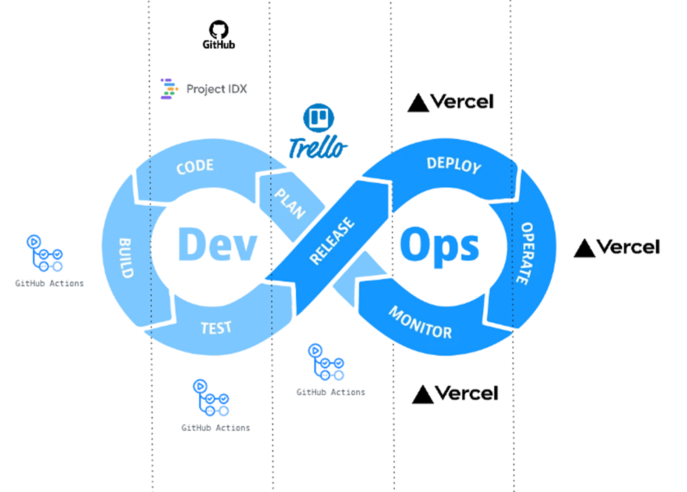

# Proyecto semestral Gestión de Proyectos de Software
Proyecto desarrollado por Matías Guiñez Monsalve y José García Navarrete estudiantes de la Universidad del Bío-Bío.

## Tabla de Contenidos
1. [Descripción](#descripción)
2. [DevOps](#devops)

## Descripción
Este proyecto se realizó como parte del curso de Gestión de Proyectos de Software. El objetivo principal fue desarrollar una aplicación siguiendo la filosofía DevOps para asegurar una integración y despliegue continuo efectivos.

## DevOps
Para asegurar un ciclo de vida de desarrollo de software eficiente y de alta calidad, se implementaron las siguientes prácticas y herramientas de DevOps:

  

### Integración Continua (CI)
Se utilizó GitHub Actions para configurar la integración continua. Cada vez que se realiza un commit, se ejecutan automáticamente los tests para garantizar que no se introduzcan errores en el código base.

### Despliegue Continuo (CD)
El despliegue continuo se configuró utilizando Vercel, lo que facilita la puesta en producción de la aplicación, además de ser un hosting gratuito. [Página DevOps](https://gsw-dev-ops.vercel.app/)

### Pipeline CI/CD
El pipeline CI/CD se compone de los siguientes pasos:
1. **Build**: Construcción de la aplicación.
2. **Test**: Ejecución de los tests para verificar el correcto funcionamiento del código.
3. **Deploy**: Despliegue de la aplicación a través de Vercel.
4. **Monitor**: Monitorización continua del rendimiento y la salud de la aplicación, utilizando las herramientas de Vercel.
